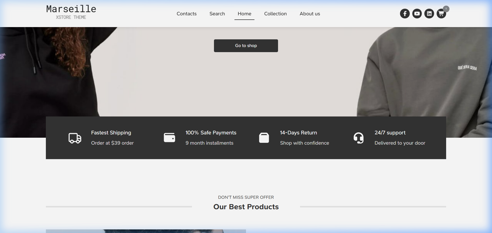
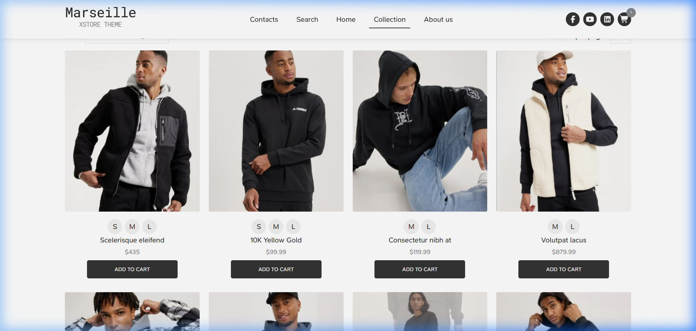
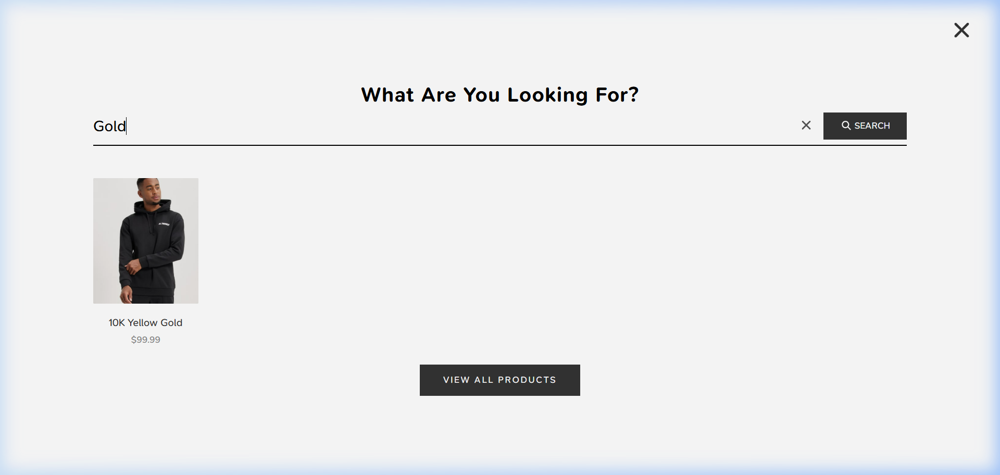
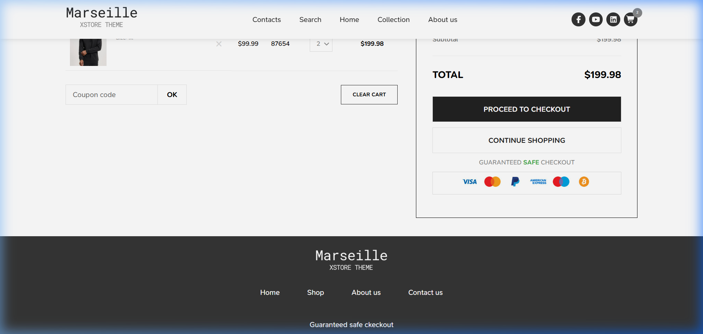
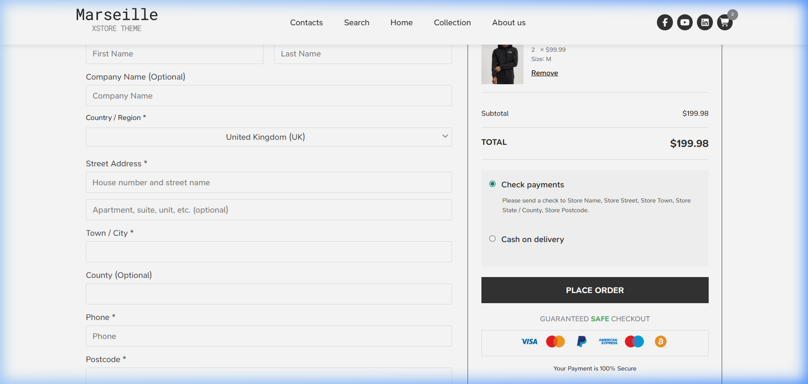

# Pro-Ecom: Scaling Performance in Modern E-Commerce

A full-featured, performance-driven e-commerce platform built with **React 19**. This project focuses on high performance, a scalable UI architecture, and robust data handling to deliver a premium shopping experience.

## Links
- **Live Demo:** [ben26-12.github.io/myEcom-ben/](https://ben26-12.github.io/myEcom-ben/)
- **Repository:** [github.com/Ben26-12/myEcom-ben](https://github.com/Ben26-12/myEcom-ben)

---

## UI Showcase

### Home Page Interface


| Collection Page | Real-time Search Overlay |
| :---: | :---: |
|  |  |
| *Intuitive filtering and product sorting* | *Optimized search with **useDebounce*** |

| Cart Page | Secure Checkout @ UK |
| :---: | :---: |
|  |  |
| *Comprehensive order management* | *Multi-step validation and summary* |

---

## Tech Stack
| Category | Technology |
| :--- | :--- |
| **Core** | React 19, Vite, JavaScript (ES6+) |
| **State Management** | Context API (Global State & UI management) |
| **Styling** | Sass (SCSS Modular Structure), Normalize.css |
| **Performance** | React Lazy Loading, Code Splitting, useDebounce |
| **Networking** | Axios (with Fail-Soft fallback logic) |
| **Form Handling** | Formik, Yup (Complex Schema Validation) |
| **Routing** | React Router Dom v7 (Dynamic Routing) |

---

## Technical Highlights & Challenges

### 1. Advanced Logic & Search Optimization
**Challenge:** Real-time search features often trigger excessive API calls or expensive re-renders as the user types, leading to performance bottlenecks.

**Solution:** Implemented a custom `useDebounce` hook to delay execution until the user has stopped typing for a specified duration (e.g., 500ms). This significantly reduces the load on the backend API and ensures a smooth, stutter-free search experience. Combined with **Price Filtering** (Low to High, Latest), this enhances user discovery without compromising performance.

### 2. Performance Optimization via Code Splitting
**Challenge:** As e-commerce apps grow, bundle size increases, leading to slow initial page load times—a critical factor for user retention.

**Solution:** Leveraged **React.lazy** and **Suspense** to implement route-based code splitting. By dynamically importing components only when they are needed (e.g., loading the `Checkout` page only when the user navigates to it), I significantly reduced the initial JavaScript payload and improved the "Time to Interactive" (TTI) metric.

### 3. Scalable & Modular UI Architecture
**Challenge:** Maintaining visual consistency and ease of maintenance across a large-scale project with diverse components like Product Cards, Steppers, and Dynamic Forms.

**Solution:** Built a library of **Reusable Components** combined with a modular **SASS (SCSS)** structure. This architecture ensures UI consistency throughout the application while allowing for rapid development and isolated styling changes, minimizing the risk of side effects.

### 4. Resilient Data & Form Handling
**Challenge:** Handling complex transaction forms (Checkout, User Details) requires strict validation and reliable state synchronization.

**Solution:** Integrated **Formik** and **Yup** for granular schema validation, coupled with **Context API** for global state management. To handle potential network instability, I architected a "Fail-Soft" middleware in my **Axios** service layer that serves `MockData` as a fallback, ensuring the user can still interact with the UI even if the primary API is intermittent.

---

## Core Features
- **Dynamic Routing:** Seamless navigation using React Router.
- **Stateful Checkout Flow:** Multi-step validation and live order summary.
- **Real-time Cart Synchronization:** Global cart management across the sidebar and main pages.
- **Smooth UX Transitions:** Integrated **React Loading Skeleton** for polished data-fetching states.
- **Responsive Design:** Optimized for all devices using CSS grid/flexbox and Sass.

---

## Project Structure
```text
/src
├── apiServices   # Modular Axios services (Cart, Product)
├── components    # Reusable UI library (Search, Stepper, ProductCard)
├── contexts      # Context API Providers (Global State Management)
├── routes        # Dynamic route configuration (Lazy Loading)
├── Pages         # Feature-specific route components
├── utils         # Custom Hooks (useDebounce) & HTTP helpers
└── App.jsx       # Root setup with Providers and Router
```

---

## Installation & Setup

1. **Clone the repository:**
   ```bash
   git clone https://github.com/Ben26-12/myEcom-ben.git
   ```
2. **Install dependencies:**
   ```bash
   npm install
   ```
3. **Run in development mode:**
   ```bash
   npm run dev
   ```
